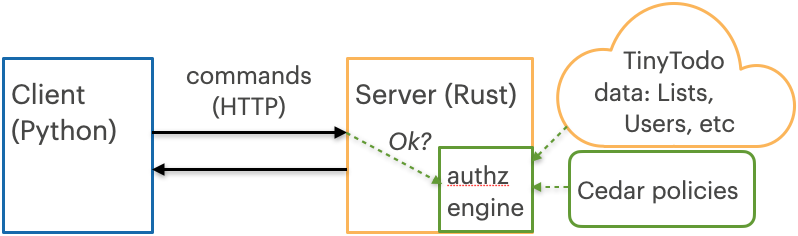
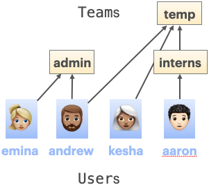
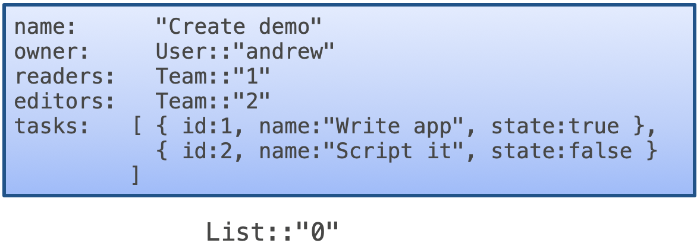

# TinyTodo:  a Cedar-based task management app

In this tutorial, we introduce Cedar and the Cedar SDK using an example application, TinyTodo, whose users and teams can organize, track, and share their todo lists. We show how to express TinyTodo permissions as Cedar policies and how TinyTodo uses the Cedar authorization engine to ensure that only intended users are granted access. We also suggest extensions to TinyTodo to help you further explore the Cedar SDK.

When you finish this tutorial, we invite you to consider a follow-on which shows [how to implement TinyTodo's policies using Cedar templates](TUTORIAL_TEMPLATE.md).

## What is TinyTodo?

TinyTodo allows individuals, called `User`s, and groups, called `Team`s, to organize, track, and share their todo lists. `User`s create `List`s which they can populate with tasks. As tasks are completed, they can be checked off the list.
TinyTodo is implemented as a server (in Rust) with a HTTP frontend, and a CLI (in Python) that interacts with the server. The server stores data (`List`s, `Team`s, `User`s, etc.) and policies in memory. The server authorizes commands it receives using Cedar’s authorization engine (no enforcement takes place at the client).



**Figure 1: TinyTodo software architecture**

In particular, when the server needs to enforce access, like when a user of TinyTodo issues a command, it makes a corresponding request to the Cedar authorization engine. The authorization engine evaluates the request in light of the Cedar policies and relevant application data (`List`s, `User`s, etc.). If it returns decision *Allow*, TinyTodo can proceed with the command. If it returns decision *Deny*, TinyTodo can report that the command is not permitted.

### Building TinyTodo

To build TinyTodo you need to install Rust and Python3. Download and build the TinyTodo code (and needed
Python3 packages) by doing the following.


<pre><code>>git clone https://github.com/cedar-policy/cedar-examples
<i>...downloading messages here</i>
> cd cedar-examples/tinytodo
> pip3 install -r requirements.txt
<i>...installation messages here</i>
> cargo build --release
<i>...build messages here</i>
</code></pre>

The `cargo build` command will automatically download and build the Cedar Rust packages `cedar-policy-core`, `cedar-policy-validator`, and others, from Rust’s standard package registry, `crates.io`, and
build the TinyTodo server, `tiny-todo-server`. The TinyTodo CLI is the Python script `tinytodo.py`, which
interacts with the server. (Note that if you get an error from `cargo` of the form `error: no matching package named cedar-policy found` it means that `cargo` could not find the Cedar packages on `crates.io` — check your configuration and/or the [Cedar GitHub site](https://github.com/cedar-policy/cedar) to see why that might be.)

### TinyTodo permissions

We don't want TinyTodo users to see all the task lists or have the power to make changes to arbitrary lists. TinyTodo uses Cedar to control who has access to what. A `List`'s creator, called its *owner*, can share the list with other `User`s or `Team`s. Owners can share lists in two different modes: *reader* and *editor*. A reader can get details of a `List` and the tasks inside it. An editor can do those things as well, but may also add new tasks, as well as edit, (un)check, and remove existing tasks.

We specify and enforce these access permissions using Cedar. Cedar is a language for writing and enforcing an application’s authorization policies. Cedar policies are expressed in syntax resembling natural language. They define who (the *principal*) can do what (the *action*) on what target (the *resource*) under which conditions (*when*).

Here is one of TinyTodo’s Cedar policies.

```
// Policy 1: A User can perform any action on a List they own
permit(principal, action, resource)
when {
    resource is List && resource.owner == principal
};
```

This policy states that any principal (a TinyTodo `User`) can perform any action on any resource, as long as the resource is a `List` and its creator, defined by its `owner` attribute, matches the requesting principal. Here’s another TinyTodo Cedar policy.

```
// Policy 2: A User can see a List and its tasks if they are a reader or editor
permit (
    principal,
    action == Action::"GetList",
    resource
)
when {
    principal in resource.readers || principal in resource.editors
};
```

This policy states that any principal can read the contents of a task list (`Action::"GetList"`) so long as they are in either the list’s `readers` group, or its `editors` group.

Cedar’s authorizer enforces *default deny*: A request is authorized only if a specific `permit` policy grants it.

The full set of policies can be found in the TinyTodo file `policies.cedar`. We will dig into the details of all of the policies and how they work a little later on.

### Running TinyTodo

Let’s run TinyTodo. To begin, we start up the CLI. From there, we start the server, assume the identity of user `andrew`, create a new todo list called `Cedar blog post`, add two tasks to that list, and then complete one of the tasks.

```shell
> python -i tinytodo.py
>>> start_server()
TinyTodo server started on port 8080
>>> set_user(andrew)
User is now andrew
>>> get_lists()
No lists for andrew
>>> create_list("Cedar blog post")
Created list ID 0
>>> get_list(0)
=== Cedar blog post ===
List ID: 0
Owner: User::"andrew"
Tasks:
>>> create_task(0,"Draft the post")
Created task on list ID 0
>>> create_task(0,"Revise and polish")
Created task on list ID 0
>>> get_list(0)
=== Cedar blog post ===
List ID: 0
Owner: User::"andrew"
Tasks:
1. [ ] Draft the post
2. [ ] Revise and polish
>>> toggle_task(0,1)
Toggled task on list ID 0
>>> get_list(0)
=== Cedar blog post ===
List ID: 0
Owner: User::"andrew"
Tasks:
1. [X] Draft the post
2. [ ] Revise and polish
```

The `get_list`, `create_task`, and `toggle_task` commands are all authorized by the Cedar *policy 1* we
saw above: since `andrew` is the owner of `List` ID 0, he is allowed to carry out any action on it.
Now, continuing as user `andrew`, we share the list with team `interns` as a reader. TinyTodo’s `User`s and `Team`s are defined in a configuration file, `entities.json`, that it reads when starting up. Out of the box, this file defines the relationship between users and teams as shown in Figure 2. We switch the user identity to `aaron`, list the tasks, and attempt to complete another task, but the attempt is denied because `aaron` is only allowed to view the list (since he’s a member of `interns`) not edit it. Finally, we switch to user `kesha` and attempt to view the list, but the attempt is not allowed (`interns` is a member of `temp`, but not the reverse). 



**Figure 2: TinyTodo Users and Teams**

```shell
>>> share_list(0,interns,read_only=True)
Shared list ID 0 with interns as reader
>>> set_user(aaron)
User is now aaron
>>> get_list(0)
=== Cedar blog post ===
List ID: 0
Owner: User::"andrew"
Tasks:
1. [X] Draft the post
2. [ ] Revise and polish
>>> toggle_task(0,2)
Access denied. User aaron is not authorized to Toggle Task on [0, 2]
>>> set_user(kesha)
User is now kesha
>>> get_list(0)
Access denied. User kesha is not authorized to Get List on [0]
>>> stop_server()
TinyTodo server stopped on port 8080
```

Here, `aaron`’s `get_list` command is authorized by the Cedar *policy 2* we saw above, since aaron is a member of the `Team` `interns`, which `andrew` made a reader of `List` ID 0. `aaron`'s `toggle_task` and `kesha`'s `get_list` commands are both denied because no specific policy exists that authorizes them.

Now let’s look at how TinyTodo is implemented. 

We first consider how TinyTodo organizes its data. Then we look at TinyTodo’s application logic, notably how it invokes Cedar’s authorization engine to authorize user commands. Next we revisit Cedar’s policies in light of these details, and explore how we can change the policies to change TinyTodo’s authorization behavior. Finally, we look at TinyTodo’s use of the Cedar to confirm that all policies conform to the application’s authorization model.

## TinyTodo data

TinyTodo data, stored in memory, consists of `User`s, `Lists`, `Tasks`, and `Team`s. This data is passed to the Cedar authorization engine in the form of Cedar *entities*, so it can be properly accessed when the engine evaluates Cedar policies. This entity format is different from the format TinyTodo uses to store and access the data in memory as it operates.

### Data as Cedar entities

The Cedar language is based on a data model that organizes **entities** into **hierarchies**. Entities serve as *principals*, *resources*, and *actions* in Cedar policies. An entity is an object with an *entity type*, an *entity identifier* (EID), zero or more *attributes* mapped to values, and zero or more *parent* entities. The entity type and entity ID are together referred to as the *entity unique ID* (UID); in Cedar syntax, an entity UID is written *type*`::"`*EID*`"`. The UID uniquely identifies an object: no two objects have both the same entity type and same EID. The parent relation on entities forms a directed acyclic graph (DAG), which we call the *entity hierarchy*. The Cedar operator `in` is used to test reachability in the hierarchy, which corresponds with group membership. Reachability `A in B` holds if and only if either `A` is equal to `B` (it’s literally the same entity UID), or `A` is a descendant of `B` in the entity hierarchy. 

In TinyTodo, we have several entity types: 

* `User` is the type of individual users. In our example run, we have four `User` entities, shown in Figure 2, with EIDs `emina`, `andrew`, `kesha`, and `aaron`, and therefore UIDs `User::"emina"`, `User::"andrew"`, `User::"kesha"`, and `User::"aaron"`, respectively.  
* `Team` is the type of teams of users. As shown in Figure 2, both `User` and `Team` entities may have other `Team` entities as their parents in the entity hierarchy, meaning that they are members of those teams. For example, `User::"andrew"` has parent (is a member of) `Team::"temp"`, and so does `Team::"interns"`. Thanks to the latter, and the transitivity of the reachability operator `in`, we have that `User::"aaron" in Team::"interns"` and also `User::"aaron" in Team::"temp"`.
* `Action` is a special entity type used for Cedar actions. One example action entity is `Action::"GetList"`, mentioned in *policy 2*. 
* `List` is the type of task lists; Figure 3 gives the list from our example run. `Lists` have five attributes: the `name` of the list; the `owner`, which is the `User` who created the `List`; the `readers` and `editors` of the list, defined as fresh `Team` entities created when the `List` is; and the individual tasks, defined as a set of records, each with three attributes: `name`, `id`, and `state` (whether the task has been completed).
* `Application` is the type of an entity, `Application::"TinyTodo"`, representing the TinyTodo application itself. All other entities have `Application::"TinyTodo"` as their parent in the hierarchy (not shown in the figures above). We use this entity when no specific entity makes sense as a request’s resource. For example, a request for principal `User::"andrew"` to perform `Action::"CreateList"` would use `Application::"TinyTodo"` as the resource.



**Figure 3: Example List entity**

### Representing and storing TinyTodo  entities

Cedar’s `cedar-policy` Rust package contains a definition of type `Entity`, but application data would not normally be represented as `Entity` objects directly, since doing so would make it inconvenient to compute on. Therefore we define *native* representations of TinyTodo objects in the file `objects.rs` in the TinyTodo `src/` directory. For example, here’s the Rust definition of the native `List` object:

```rust
pub struct List {
    uid: ListUid,
    owner: UserUid,
    name: String,
    tasks: Vec<Task>, // Invariant, `tasks` must be sorted
    readers: TeamUid,
    editors: TeamUid,
}
```

We can see that a native `List`’s native representation mirrors its structure as a Cedar entity (Figure 3), including fields that simply reference other entities by their UID. The `uid` field is the UID of this list. The types `TeamUid`, `ListUid`, and `UserUid` are just transparent wrappers around Cedar’s standard `EntityUid` type, but with an API that forces them to have the proper entity type (see `utils.rs`).

TinyTodo native objects are collected in an `EntityStore`, defined in `entitystore.rs`. In addition to collecting native objects in one place, an `EntityStore` provides an `as_entities` method, with which you can convert the native objects to Cedar `Entity` objects, to be passed to the Cedar authorization engine when it evaluates a request. To convert native objects to `Entity` objects, we implement (in `objects.rs`) the `From<List>`, `From<Team>`, etc. traits for `Entity`, and `as_entities` converts the stored native objects by invoking `from` methods in these traits.

### Initializing User and Team entities

Some TinyTodo data, e.g., `User`s and named `Team`s, are defined when the application starts up and cannot be changed once the application starts running. (Allowing changes to teams and users is a TinyTodo extension we consider later.) The file `entities.json`, parsed by the server at startup, contains the definitions of these data items in JSON format. The definitions of native objects `Team`, `User`, etc. in `objects.rs` use the `serde` Rust package to implement JSON deserializers, as indicated by the `#derive(...,Deserialize)` annotation above them. Here are a couple of definitions from the `entities.json` file:

```json
"User::\"aaron\"": {
    "euid": "User::\"aaron\"",
    "parents": [
        "Team::\"interns\"",
        "Application::\"TinyTodo\""
    ]
},
...
"Team::\"interns\"": {
    "uid": "Team::\"interns\"",
    "parents": [
        "Application::\"TinyTodo\"",
        "Team::\"temp\""
    ]
},
```

We can see that `User::"aaron"` has no attributes, nor does `Team::"interns"` (as is the case for all `User`s and `Team`s). As also depicted in Figure 2, `User::"aaron"` has among its `parents` the `Team::"interns"`, while `Team::"interns"` has `Team::"temp"` among its parents. Both entities have `Application::"TinyTodo"` as a parent.

## TinyTodo logic, with authorization by Cedar

The TinyTodo server uses the `Warp` package for writing web applications, which builds on top of Rust’s standard `tokio` framework for asynchronous/multithreaded computation. The `main` method in `main.rs` begins by invoking `AppContext::spawn(...)`, defined in `context.rs`, which reads in TinyTodo’s initial `User` and `Team` entities (in `entities.json`), schema (in `tinytodo.cedarschema.json`, discussed later), and Cedar policies (in `policies.cedar`). The results are stored in fields of the `AppContext` object. The `spawn(...)` method then starts a thread listening for HTTP connections. When a HTTP request comes in, it is parsed into a Warp `AppQueryKind` object (see `context.rs` and `api.rs`) by the `serve` method in `context.rs` and dispatched to the appropriate handler. Each handler authorizes the request against the Cedar policies before carrying out the application logic. Doing so nicely separates authorization from application code — as we will see later, we can add, update, and analyze the policies without changing the application.

### Handling a request

When a the TinyTodo server invokes a handler in response to a user request, the handler checks to see if that request is allowed by invoking the Cedar authorization engine. To do so, it translates the user request information into a Cedar `Request` and passes it with relevant data to the Cedar authorization engine, which either allows or denies the request. If the request is permitted, the handler carries out the appropriate application logic.

For example, consider the code for function `create_task` in `context.rs`. This handler is called when a user wants to add a task to a list.

```rust
fn create_task(&mut self, r: CreateTask) -> Result<AppResponse> {
    self.is_authorized(&r.uid, &*ACTION_CREATE_TASK, &r.list)?;
    let list = self.entities.get_list_mut(&r.list)?;
    let task_id = list.create_task(r.name);
    Ok(AppResponse::TaskId(task_id))
}
```

Parameter `r` is the object that contains the user request information, which is created based on the HTTP message received from the client. The type `CreateTask` is defined with other request types in file `api.rs`. 

```rust
pub struct CreateTask {
    pub uid: UserUid,
    pub list: ListUid,
    pub name: String,
}
```

The `uid` is the `User` entity making the request; the `list` is the `List` entity to which the task should be added; and the `name` is the textual description of the task. 

The first line of `create_task` calls `self.is_authorized`, defined later in the file `context.rs`, to authorize the request before continuing with the command logic. The three parameters to this method are entity UIDs for the principal, action, and resource, respectively, where the first and last of these come from the `CreateTask` parameter `r`, and `&*ACTION_CREATE_TASK` corresponds to the entity UID `Action::"CreateTask"`. If the `self.is_authorized` call returns `Ok(())` then `create_task` continues on to implement the logic of creating a new task. If the call returns `Err(...)` then `create_task` returns immediately with an authorization error (which is the effect of the `?` operator at the end of the invocation of `self.is_authorized`).

### Invoking the Cedar authorization engine

The `self.is_authorized` call resolves to the method at the bottom of `context.rs`. This method encapsulates logic to invoke the Cedar authorization engine.

```rust
pub fn is_authorized(
    &self,
    principal: impl AsRef<EntityUid>,
    action: impl AsRef<EntityUid>,
    resource: impl AsRef<EntityUid>,
) -> Result<()> {
    let es = self.entities.as_entities(&self.schema);
    let q = Request::new(
        Some(principal.as_ref().clone().into()),
        Some(action.as_ref().clone().into()),
        Some(resource.as_ref().clone().into()),
        Context::empty(),
        Some(&self.schema),
    )
    .map_err(|e| Error::Request(e.to_string()))?;
    info!(
        "is_authorized request: principal: {}, action: {}, resource: {}",
        principal.as_ref(),
        action.as_ref(),
        resource.as_ref()
    );
    let response = self.authorizer.is_authorized(&q, &self.policies, &es);
    info!("Auth response: {:?}", response);
    match response.decision() {
        Decision::Allow => Ok(()),
        Decision::Deny => Err(Error::AuthDenied(response.diagnostics().clone())),
    }
}
```

The code invokes the Cedar authorization engine, part of the package `cedar_policy`, via ``self.authorizer.is_authorized(&q, &self.policies, &es)``. The first argument ``&q`` is the access `Request` — can the ``principal`` perform ``action`` on ``resource`` (with an empty `Context`)? As an example from our sample run above, the `Request` might be whether ``User::"kesha"`` can perform action ``Action::"CreateTask"`` on resource ``List::"0"``. The second argument is the set of Cedar policies ``&self.policies`` the engine will consult when deciding the request; these were read in by the server when it started up (see the `AppContext` method `spawn` also defined in `context.rs`). The last argument ``&es`` is the set of Cedar `Entity` objects the engine will consider when consulting the policies. Variable `es` is initialized by calling `as_entities()` on the `AppContext`’s `entities` field, which contains the `EntityStore`, discussed in the previous section. (Since `Action` entities are not members of a hierarchy, and have no attributes, we don’t actually have to make `Action` entities to include with `&es` in this case.) The Cedar authorizer returns a response: If it is ``Decision::Allow`` then the request is `Ok`, else it is an `Err`, which as we saw above will result in an error being returned back to the client.

## TinyTodo Cedar policies

Let’s revisit the Cedar policies for TinyTodo now that we have fleshed out some details of the application’s data model and control logic. We saw policies 1 and 2 at the start of this tutorial; now we will see all four.

```
// Policy 0: Any User can create a list and see what lists they own
permit (
    principal,
    action in [Action::"CreateList", Action::"GetLists"],
    resource == Application::"TinyTodo"
);

// Policy 1: A User can perform any action on a List they own 
permit (principal, action, resource)
when {
    resource is List &&
    resource.owner == principal
};

// Policy 2: A User can see a List and its tasks if they are either a reader or editor
permit (
    principal,
    action == Action::"GetList",
    resource
)
when {
    principal in resource.readers ||
    principal in resource.editors
};

// Policy 3: A User can update a List and its tasks if they are an editor
permit (
    principal,
    action in [
        Action::"UpdateList",
        Action::"CreateTask",
        Action::"UpdateTask",
        Action::"DeleteTask"
    ],
    resource
)
when { principal in resource.editors };
```

In words, the policies can be described as follows:

1. Any user can perform actions `CreateList`, `GetLists` (to create a list, and enumerate owned lists, respectively).
2. The `List` owner can perform any action on it (`EditList`, `DeleteList`, `CreateTask`, ...).
3. A `List` reader can perform read-only actions on it (`GetList`).
4. A `List` editor can perform read and write actions on it (`GetList`, `UpdateList`, `DeleteTask`, ...).

To see how these policies affect the outcome, suppose user `kesha` attempts to create a task `"write release notes"` for list ID 0, which `andrew` created. This will result in the `create_task` handler being called, which we looked at earlier, which in turn will call `is_authorized` with a Cedar `Request` asking whether principal `User::"kesha"`  can perform action `Action::"CreateTask"` on resource `List::"0"`. The `is_authorized` call will also include the entities `&es` constructed from our `EntityStore`, which the Cedar authorization engine can consult when it evaluates each of the provided policies, one at a time. 

For this particular request, here’s how that evaluation goes:

* policy 0 evaluates to `false` since `Action::"CreateTask"` is not a member of the list of actions given in the policy, `[Action::"CreateList", Action::"GetLists"]`.  
* policy 1 evaluates to `false` since `List::"0".owner` is `User::"andrew"`, which is not the `principal` of the request, `User::"kesha"`
* policy 2 evaluates to `false` since `Action::"CreateTask"` is not `Action::"GetList"`.
* policy 3 evaluates to `false` since, because while `Action::"CreateTask"` *is* in the list of actions in the policy, `User::"kesha"` is not a member of the `List::"0".editors` team.

Since no `permit` policies evaluates to `true` (we say that no policy is *satisfied*), then the `Request` is denied. If any one of them had evaluated to `true`, then the request would have been permitted. For example, if it was `andrew` who had attempted to create the task, policy 1 would have evaluated to `true` because the principal in the request would indeed be the list’s owner `User::"andrew"`.

### Implementing `List` sharing

Let’s revisit the `share_list(0,interns,read_only=True)` command we had `User::"andrew"` execute in our sample run. How was this command authorized, and what happened so that `User::"aaron"` could subsequently read the list? The `share_list()` CLI command induces `add_share()` in `context.rs` to be called. Here’s its code:

```rust
fn add_share(&mut self, r: AddShare) -> Result<AppResponse> {
    self.is_authorized(&r.uid, &*ACTION_EDIT_SHARE, &r.list)?;
    let list = self.entities.get_list(&r.list)?;
    let team_uid = list.get_team(r.role).clone();
    let target_entity = self.entities.get_user_or_team_mut(&r.share_with)?;
    target_entity.insert_parent(team_uid);
    Ok(AppResponse::Unit(()))
}
```

The first line causes tries to authorize the request that `User::"andrew"` perform `Action::"EditShare"` on resource `List::"0"`. The `is_authorized` call returns `Ok()` because *policy 1* evaluates to `true`, since `List::"0".owner == User::"andrew"` (see Figure 3). The call to `get_list` then retrieves the native `List` object for `List::"0"` from `self.entities`, our `EntityStore`. The call to `get_team` extracts the relevant `Team` associated with the list’s `readers` or `editors` attributes. Since `r.role` is `Reader` in this case, `get_team(r.role)` gets the `readers` team UID from  `list`, which is `Team::"1"` (see Figure 3). Next, the `get_user_or_team_mut` call gets the `User` or `Team` to share the list with, which in this case is `Team::"interns"`. Finally, the call to `insert_parent` adds `Team::"1"` to the parents of `Team::"interns"`. Doing so has the net effect that all members of `Team::"interns"` are, by transitivity, considered to be `in` `Team::"1"`. As a result, when the request asking whether `User::"aaron"` can perform `Action::"GetList"` on `List::"0"` comes in, *policy 2* authorizes it because `User::"aaron" in List::"0".readers` by virtue of `User::"aaron" in Team::"interns"` being true.

### Extending the policies 

Let’s see how we can extend the Cedar policies to effect permission changes to the application without changing its code. Here’s our first extension: Members of `Team::"admin"` can perform any action on any TinyTodo `List` (all of which have `Application::"TinyTodo"` as their parent). This rule is expressed by the following policy:

```
// Policy 4: Admins can perform any action on any resource
@id("admin-omnipotence")
permit (
    principal in Team::"admin",
    action,
    resource in Application::"TinyTodo"
 );
```

In this policy we have used a [Cedar policy _annotation_](https://docs.cedarpolicy.com/policies/syntax-policy.html#term-parc-annotations) `@id(...)`. Annotations have no built-in semantics in Cedar, so it is up to the application to decide how to use them. The [Cedar command-line interface (CLI)](https://github.com/cedar-policy/cedar/tree/main/cedar-policy-cli) uses the `@id(...)` annotation to give a name to the target policy, and we adopt the same convention for TinyTodo. By default, policies are named `policy`_N_ where _N_ is a number starting at 0 that increases with each policy added to the policy set. We adopt code from the CLI that post-processes parsed policies and renames them according to any present `@id` annotation. This name will be used in an authorization's response diagnostics, as we will see below.

Per Figure 2, user ``emina`` is a member of ``Team::"admin"`` so if we start TinyTodo with this new policy added to `policies.cedar`, ``emina`` is able to view and edit any list, even without it being explicitly shared. We see this in the transcript below, which shows TinyTodo run with output logging enabled via the environment variable `RUST_LOG` to level `info`. The log messages show the requests sent to Cedar's authorization engine and the responses it sends back. (We have elided some logging messages and simplified others, for readability.)

```shell
> RUST_LOG=info python -i tinytodo.py
>>> start_server()
TinyTodo server started on port 8080
  INFO (messages elided ...)

>>> set_user(andrew)
User is now andrew
>>> create_list("Cedar blog post")
  INFO tiny_todo_server::context: is_authorized request: principal: User::"andrew", action: Action::"CreateList", resource: Application::"TinyTodo"

  INFO tiny_todo_server::context: Auth response: Response { decision: Allow, diagnostics: Diagnostics { reason: {PolicyId(PolicyID("policy 0")), PolicyId(PolicyID("admin-omnipotence"))}, errors: [] } }

Created list ID 0
>>> set_user(emina)
User is now emina
>>> get_list(0)
  INFO tiny_todo_server::context: is_authorized request: principal: User::"emina", action: Action::"GetList", resource: List::"0"

  INFO tiny_todo_server::context: Auth response: Response { decision: Allow, diagnostics: Diagnostics { reason: {PolicyId(PolicyID("admin-omnipotence"))}, errors: [] } }

=== Cedar blog post ===
List ID: 0
Owner: User::"andrew"
Tasks:
>>> delete_list(0)
  INFO tiny_todo_server::context: is_authorized request: principal: User::"emina", action: Action::"DeleteList", resource: List::"0"

  INFO tiny_todo_server::context: Auth response: Response { decision: Allow, diagnostics: Diagnostics { reason: {PolicyId(PolicyID("admin-omnipotence"))}, errors: [] } }

List Deleted
>>> stop_server()
TinyTodo server stopped on port 8080
```
Notice in the `INFO` messages that Andrew's creation of the list is authorized by `PolicyID` `"policy0"`, the default ID for the first policy, whereas Emina's reading and updating of the list is authorized by `PolicyID` `"admin-omnipotence"`, the name given via `@id` annotation to our newly-added policy.

As another extension, we can add this policy:

```
// Policy 5: Interns may not create new task lists
forbid (
   principal in Team::"interns",
   action == Action::"CreateList",
   resource == Application::"TinyTodo"
);
```

This policy states that any principal who is an intern (in `Team::"interns"`) is *forbidden* from creating a new task list (`Action::"CreateList"`) using TinyTodo (`Application::"TinyTodo"`). In Cedar, `forbid` policies always take precedence over `permit` policies, i.e., even if a `permit` policy might authorize a request, a `forbid` policy can override that authorization. For TinyTodo, *policy 0* permits *any* user to create a task list, but *policy 5* overrides that permission for users in `Team::"interns"`. Note that the order of Cedar policies doesn’t affect this behavior.

As per Figure 2, user ``aaron`` is a member of ``Team::"interns"`` so if we start TinyTodo with this new policy added to `policies.cedar` we can see ``aaron`` is not able to create a task list.

```shell
> python -i tinytodo.py
>>> start_server()
=== TinyTodo started on port 8080
>>> set_user(aaron)
User is now aaron
>>> create_list("my task list")
Access denied. User aaron is not authorized to Create List on [my task list]
>>> set_user(emina)
User is now emina
>>> create_list("my task list") 
Created list ID 0
>>> stop_server()
TinyTodo server stopped on port 8080
```

## Validating Cedar policies

When the `AppContext::spawn(...)` method reads in the Cedar policies (and renames them according to their `@id` annotations, if present), it also reads in a Cedar *schema* against which it validates the policies. After reading in the `schema` from the file `tinytodo.cedarschema.json`, the method creates a `Validator` object (from the `cedar-policy-validator` package) and invokes its `validator.validate` method. Here is the `spawn` method, where you can see the code for this.

```rust
pub fn spawn(
    entities_path: impl Into<PathBuf>,
    schema_path: impl Into<PathBuf>,
    policies_path: impl Into<PathBuf>,
) -> std::result::Result<Sender<AppQuery>, ContextError> {
    ...
    let schema_file = std::fs::File::open(&schema_path)?;
    let schema = Schema::from_file(schema_file)?;
    ...
    let policy_src = std::fs::read_to_string(&policies_path)?;
    let policies0 = policy_src.parse()?;
    let policies = rename_from_id_annotation(policies0)?;
    let validator = Validator::new(schema.clone());
    let output = validator.validate(&policies, ValidationMode::default());
    if output.validation_passed() {
    // ... start serving requests ...
```

If the policies were inconsistent with the schema, `output.validation_passed` would be `false`. To see this, try editing the `policies.cedar` file and introduce a typo in one of the policies, like changing `readers` to `Readers` in policy 2, or changing `Action::"CreateTask"` to `Action::"CrateTask"` in *policy 0*. When you start up the server, the validator will complain about use of an unknown attribute in the first case, and about an unknown action in the second case, and abort execution. (You can use the [Cedar CLI](https://github.com/cedar-policy/cedar/tree/main/cedar-policy-cli) executable `cedar`, which you can install as part of the `cedar-policy-cli` Rust crate, to run the validator on your policies before validating them in your application.)

### Schemas

A Cedar schema has two parts, the `entityTypes` and the `actions`. The first describes the type structure of the various entity types: What attributes they have, and how they can be organized in the entity hierarchy. The second enumerates the names of the actions that the application uses, and assumptions about the entity types for the `principal` and `resource` components of requests that involve each action.

Looking at `tinytodo.cedarschema.json`, here’s the part of the `entityTypes` that defines the structure of the `List` entity. The `memberOfTypes` attribute indicates that `List` can have `Application` entities as its parents in the entity hierarchy, which validates that individual lists will have the entity `Application::"TinyTodo"` as their parent. The `shape` part describes the attributes of a `List` entity using JSON schema-like format. You can see how entity `List::"0"` in Figure 3 matches this described shape.

```json
"List": {
    "memberOfTypes": [
        "Application"
    ],
    "shape": {
        "type": "Record",
        "attributes": {
            "owner": {
                "type": "Entity",
                "name": "User"
            },
            "name": {
                "type": "String"
            },
            "readers": {
                "type": "Entity",
                "name": "Team"
            },
            "editors": {
                "type": "Entity",
                "name": "Team"
            },
            "tasks": {
                "type": "Set",
                "element": {
                    "type": "Record",
                    "attributes": {
                        "name": {
                            "type": "String"
                        },
                        "id": {
                            "type": "Long"
                        },
                        "state": {
                            "type": "String"
                        }
                    }
                }
            }
        }
    }
}
```

Here is a snippet of the `actions` part of `tinytodo.cedarschema.json`, describing two TinyTodo actions, `Action::"CreateList"` and `Action::"CreateTask"`. 

```json
"CreateList" : {
    "appliesTo" : {
        "principalTypes" : [ "User" ],
        "resourceTypes" : [ "Application" ]
    }
},
"CreateTask" : { 
    "appliesTo" : { 
        "principalTypes" : [ "User" ],
        "resourceTypes" : [ "List" ]
    }
},
```

The `appliesTo` part enumerates the allowed entity types for the principal and resource components of a request involving the given action. The schema states that `Action::"CreateList"` requests should have `User` entities for the principal part and `Application` entities for the `resource` part, whereas `Action::"CreateTask"` should have `User`s and `List`s for those parts. 

In general, it’s up to the application to make sure that `appliesTo` assumptions in the schema are adhered to. TinyTodo checks these assumptions in the deserialization code when it creates objects like `CreateTask` (shown earlier) from an HTTP request. Because `CreateTask` and other request objects indicate the precise type of UID that’s expected, e.g., `UserUid` or `ListUid`, the deserialization code will confirm that what’s received from the client has the right entity type.

## Learn More

This completes our tour of TinyTodo, an example application that uses Cedar for enforcing permissions. Here are some resources for learning more about Cedar and using it in your applications.

* Cedar tutorial and playground: [https://www.cedarpolicy.com](https://www.cedarpolicy.com/) 
* Other example apps: https://github.com/cedar-policy/cedar-examples
* Cedar SDK documentation: https://docs.cedarpolicy.com/
* Amazon Verified Permissions, which builds an authorization service around Cedar: https://aws.amazon.com/verified-permissions/

## Extensions

Before we go, let’s consider some ways you could extend TinyTodo, to get more experience using Cedar.

### Persisting TinyTodo data
Make a command that saves the full entity store, including `List`s (and not just `User`s and `Team`s) to the `entities.json` file so that users can re-access their lists. Alternatively, save the entity store after each command, automatically. For bonus points, implement a persistent entity store directly, e.g., on top of a database.

### Add CRUD commands for `User`s and `Team`s
`User`s and `Team`s are specified in `entities.json` only; you cannot create new users or teams via TinyTodo itself. Extend it with additional commands, and Cedar policies and schema, to allow the creation, deletion, update, etc. of `User`s and `Team`s. Suppose only members of `Team::"admin"` should be able to carry out these actions — do you need to write a new policy to allow that? 


### Implement Timeboxed Sharing
Extend the notion of sharing to include time-limited sharing. A user should be able to share a list with another user for a limited amount of time, 
and have the permission to read/edit that list automatically revoked. An implementation of this feature can be found in the `features/timebox` branch.

### Implement *Entity Slicing*
The `is_authorized` code in `context.rs`, which we discussed above, the line `let es = self.entities.as_entities();` converts the entire contents of the `EntityStore` to Cedar entities, and passes it with each call to Cedar’s authorization engine. While doing this is safe, it’s also potentially expensive: `as_entities` will create and populate new Rust `Entity` objects, and it will do so for objects that may not actually be relevant the request being considered. 

For example, suppose we submit request asking, can 

* principal `User::"kesha"`  
* perform action `Action::"CreateTask"` 
* on resource `List::"0"`?

What entities are relevant to policies that could authorize this request? Here are some observations (based only on policies 0-5) that suggest an algorithm:

* The only relevant `List` entity is `List::"0"` itself — according to policies 0-5 developed so far, other lists created by other users will have no bearing on the decision. Indeed, this is true for *all* requests we have developed so far: You only need to include the `List` that is provided as the resource, and no others.
* The only relevant `User` entity is `User::"kesha"`. That’s because access is granted either
    * unconditionally (e.g., for policy 0),
    * if the principal is `==` to the `owner` attribute of the `List` resource (policy 1). It turns out that `==` is decided for entities by only looking at the entity UID, not at the entity’s actual contents. So we don’t need to provide the entity pointed to by `List::"0".owner`, which for this request is `User::"andrew"`, in the passed-in entities
    * if the principal is a member of a particular `Team`, regardless of other `User`s who might also be members of various `Team`s. 
* The last sub-bullet above means we have to pass in `Team` membership data for the requesting principal, i.e., `User::"kesha"`. We can do this by basically computing the transitive closure of `User::"kesha"`’s parents in the entity hierarchy, i.e., that `User::"kesha"` is a member of `Team::"temp"`, and that’s all — all other `Team` data (including about `Team::"1"` and `Team::"2"`, which are the `readers` and `editors` of `List::"0"`, respectively) can be elided.

Providing only the needed entity data can net a significant savings. A nice extension would be to **implement a more optimized `as_entities` method for `EntityStore`,** which takes the `principal` and `resource` elements of a request, and returns back only the relevant `Entities`, following the reasoning above. The process of choosing the relevant entities from the store based on a request is called *entity slicing*.

The main concern with entity slicing is that writing the algorithm for doing it requires thinking about the specific policies we have right now. If we developed future policies, their expectations may require entities not included in the slice. For example, suppose we added *policy 6* which stated 

```
permit(
  principal,
  action == Action::"CreateTask",
  resource)
when {
  !(principal in Team::"interns") &&
  resource.owner in Team::"interns"
}
```

This policy says any non-intern can create tasks on `List`s whose owners are interns (this assumes that policy 5, which disallows interns from creating lists, is not in effect). This policy needs to know not just what `Team`s the requesting principal is in, but also those of the `List` resource’s `owner`. If we used the algorithm suggested by the observations above, we would not include this `Team` data and we would get the wrong answer. Always providing all of the entity data avoids this problem. Another way to avoid it is to write a general-purpose slicing algorithm that works by examining the policies themselves in order to determine what entities to provide. 

