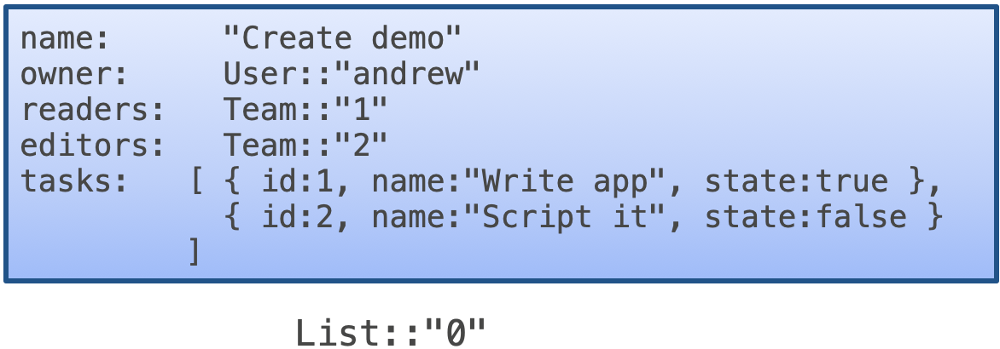

# TinyTodo with Templates

This is an extension to the tutorial for TinyTodo, an example application whose users and teams can organize, track, and share their todo lists. In the main tutorial we represented a list's allowed readers and editors as attributes of the list itself. In this extension, we represent them instead using Cedar's *template-linked policies*. This tutorial assumes you're familiar with the [main tutorial](TUTORIAL.md) already.

## Building and running templated TinyTodo

Recall the main tutorial's instructions for downloading and building TinyTodo:

<pre><code>>git clone https://github.com/cedar-policy/cedar-examples
<i>...downloading messages here</i>
> cd cedar-examples/tinytodo
> pip3 install -r requirements.txt
<i>...installation messages here</i>
> cargo build --release 
<i>...build messages here</i>
</code></pre>

To build the templated version, you should redo the last step:
<pre><code>
> cargo build --release --features=use-templates
</code></pre>
This enables the `use-templates` feature flag which causes various TinyTodo `.rs` source files to be compiled differently.

Running and interacting with the template-policy version of TinyTodo is the same as in the main tutorial. You should be able to carry out the same set of commands and get the same responses, with the only difference being that some `INFO` logging messages will be different.

## What is a Cedar template-linked policy?

A Cedar _template_ is a Cedar policy that contains _slots_, which can be filled in to make a complete policy that can be evaluated to make an authorization decision. Filling in a slot is called _linking_ and a fully-linked template is called a _template-linked policy_. By using different values for a template's slots, the same template can be linked into more than one policy, all stored in the same policy set.

### Example

Here is an example Cedar template:

```
// Example: Any principal in the [?principal] group may update photos tagged public
@id("comment-template")
permit(
    principal in ?principal,
    action == Action::"AddComment",
    resource
)
when { resource.tags.contains("public") };
```

This template has one slot, `?principal`. We can link this template against an entity UID to produce a template-linked policy. For example, if we linked the template against `UserGroup::"PaidSubscribers"` then we would get the following template-linked policy:

```
permit(
    principal in User::"PaidSubscribers",
    action == Action::"AddComment",
    resource
)
when { resource.tags.contains("public") };
```

In the Cedar SDK API, linking a template requires providing a policy set, the ID of the template in the policy set, and the values to link in. How do we know the template's ID? When defining the template we can use a [Cedar _policy annotation_](https://docs.cedarpolicy.com/policies/syntax-policy.html#term-parc-annotations) to specify it. The [Cedar command-line interface](https://github.com/cedar-policy/cedar/tree/main/cedar-policy-cli) uses the annotation `@id(...)` for this purpose, and we follow that convention above, giving the template above the ID `comment-template`.

Cedar templates have a limited structure: They can only have one or two slots, `?principal` and/or `?resource`, and these slots can only appear on the righthand-side of the `in` or `==` that constrains the `principal` or `resource` elements of the policy scope. The Cedar policy syntax may expand in the future to support a wider variety of templates.

### When to use templates?

Templates are useful when you want to use policies to add or remove permissions in response to user activity with your application. For example, allowing a user to add a permission to an application object could be implemented by linking a template to create a policy that provides that permission. Doing this makes sense if there's no other data your application might already be storing that conveys the permission to be added. I.e., all you care about can be expressed in that policy.

A template bears some resemblance to a [SQL prepared statement](https://www.w3schools.com/php/php_mysql_prepared_statements.asp), where template slots play the same role as a prepared statement's _parameters_ (also sometimes called _placeholders_). Cedar template-linked policies have the same security benefits as prepared statements: They can support on-the-fly construction of policies in a way that prevents code injection attacks. 

Templates also provide benefits to policy management. If your policy store has many policies linked to the same template, then updating that template can be made to automatically update all of its linked instances. Doing so is beneficial if the template represents a _kind_ of permission, where the conditions defining that permission may evolve over time.

## Updating TinyTodo's policies to use templates

In TinyTodo we can use templates for policies that correspond to reader and editor permissions. We can have TinyTodo link a template whenever a list's owner grants reader/editor permissions on it. Let's review how TinyTodo originally solved this problem, and then we'll show the template approach and contrast the two.

### Old policies

As a refresher, here are the policies we used in the original TinyTodo to grant permissions to a list's readers and editors. They can be found in the `policies.cedar` file. The first policy states that both readers and editors are allowed to see the contents of a list:

```
// Policy 2: A User can see a List and its tasks if they are a reader or editor
permit (
    principal,
    action == Action::"GetList",
    resource
)
when {
    principal in resource.readers || principal in resource.editors
};
```

The next policy states that a list's editors are allowed to modify the list in various ways:

```
// Policy 3: A User can update a List and its tasks if they are an editor
permit (
    principal,
    action in [
        Action::"UpdateList",
        Action::"CreateTask",
        Action::"UpdateTask",
        Action::"DeleteTask"
    ],
    resource
)
when { principal in resource.editors };
```

In these policies, the `List` entity is assumed to have `readers` and `editors` attributes that reference corresponding entity groups with type `Team`. An example `List::"0"` entity illustrating this is shown in Figure 1.



**Figure 1: Example List entity**

Suppose that `User::"Andrew"`, the owner of `List::"0"`, wants to share this list with `Team::"interns"` as read-only. To make this happen, TinyTodo will update `Team::"1"` to have `Team::"interns"` as one of its parents. Because `List::"0".readers` references `Team::"1"`, the expression `User::"aaron" in List::"0".readers` will evaluate to true: `User::"aaron"` has parent (is a member of) `Team::"interns"`, which has parent `Team::"1"`, and thus `User::"aaron" in Team::"1"`.


### Template-linked policies

Now let's see the two templates we will use to replace these policies. They can be found in the `policies-templates.cedar` file.

```
// Policy 2: Users who are members of [?principal] are readers of [?resource]
@id("reader-template")
permit (
    principal in ?principal,
    action == Action::"GetList",
    resource == ?resource
);

// Policy 3: Users who are members of [?principal] are editors of [?resource]
@id("editor-template")
permit (
    principal in ?principal,
    action in
        [Action::"GetList",
         Action::"UpdateList",
         Action::"CreateTask",
         Action::"UpdateTask",
         Action::"DeleteTask"],
    resource == ?resource
);
```

With these templates, each time a `List` owner shares the list with a `User` or `Team`, TinyTodo will link one of the above templates to the respective `User` or `Team` as the `?principal`, and the `List` as the `?resource`. The `reader-template` corresponds to the `readers` attribute we had on lists with the old policies: When previously we would have added _U_ to  _L_`.readers`, now we link `reader-template` with _U_ as the `?principal` and _L_ as the `?resource`. The `editor-template` similarly corresponds to the old `List.editors` attribute.

To see how this works, consider what happens when `User::"Andrew"` shares his list, `List::"0"`, with `Team::"interns"` as read-only. TinyTodo will link `reader-template` with `?principal` as `Team::"interns"` and `?resource` as `List::"0"` and thereby add the following template-linked policy in the policy store:
```
permit (
    principal in Team::"interns",
    action == Action::"GetList",
    resource == List::"0"
);
```
This newly-added policy will allow `User::"aaron"` to see the contents of `List::"0"` because he is a member of `Team::"interns"`.

Conversely, each time a `List` owner wishes to _unshare_ a list with a particular `User` or `Team`, TinyTodo will _unlink_ the corresponding template, removing it from the policy store.

`List` entities no longer need the `readers` or `editors` attributes. Those attributes' entire function was to track permissions, and that function is now handled using templates. Switching to templates has the useful benefit that it reduces the entities that need to be passed in with a Cedar authorization request -- what used to be captured as an entity is now (already) in the policy store.

## TinyTodo authorization logic

We'll finish out this tutorial by looking at the changes to the TinyTodo code needed to leverage templates.

### Implementing `List` sharing

Using the Python client, the running example we've been using so far is expressed by the command `share_list(0,interns,read_only=True)` (which follows other commands that created the list 0; see the original tutorial for more). This command will send an HTTP request to the TinyTodo server which induces the `add_share()` function in `context.rs` to be called. Here is its code; it's a lot to digest, so we'll work through it bit by bit.

```rust
fn add_share(&mut self, r: AddShare) -> Result<AppResponse> {
    self.is_authorized(&r.uid, &*ACTION_EDIT_SHARE, &r.list)?;
    // Confirm that the identified list and sharer are known
    let _list = self.entities.get_list(&r.list)?;
    let _target_entity = self.entities.get_user_or_team_mut(&r.share_with)?;
    // Link a template to register the new permission
    let tid = match r.role {
        ShareRole::Reader => PolicyId::from_str("reader-template")?,
        ShareRole::Editor => PolicyId::from_str("editor-template")?,
    };
    // Construct template linking environment
    let target_euid: &cedar_policy::EntityUid = r.share_with.as_ref();
    let list_euid: &cedar_policy::EntityUid = r.list.as_ref();
    let env: HashMap<SlotId, cedar_policy::EntityUid> = [
        (SlotId::principal(), target_euid.clone()),
        (SlotId::resource(), list_euid.clone()),
    ]
    .into_iter()
    .collect();
    // Link it!
    let pid = Self::linked_policy_id(r.role, r.share_with, r.list)?;
    self.policies.link(tid, pid.clone(), env)?;
    info!("Created policy {pid}");
}
```
The first line tries to authorize the request; for our example, it checks that `User::"andrew"` can perform `Action::"EditShare"` on resource `List::"0"`. The `is_authorized` call returns `Ok()` because *policy 1* evaluates to `true`, since `List::"0".owner == User::"andrew"` (see Figure 3 in the original tutorial). The call to `get_list` then retrieves the native `List` object for `List::"0"` from `self.entities`, our `EntityStore`. The next call `get_user_or_team_mut` gets the `User` or `Team` to share the list with, which in this case is `Team::"interns"`. If either call fails then the target objects don't exist in the entity store and an error is sent back.

Next, we construct the name of the template we will link: if `r.role` is `Reader`, as in our example, the template ID is `reader-template`. Now we construct the entity UIDs to link `?principal` and `?resource` against, and store them in `env`, a hashmap. Then we call the function `linked_policy_id` (not shown) to construct the policy ID from the sharing role, the target user/team, and the list. This function is injective, so we can be sure no two linked policies will have the same ID. In the case of our example, a policy ID is `reader[interns][0]`. Finally, we link the policy into the policy store.

**Note**: The code in the actual `context.rs` file _conditionally compiles_ in code for using templates rather than entity attributes, using Rust macro `#[cfg(feature = "use-templates")]`. We do not show that code here in order to avoid clutter.

### Unsharing a `List`

Unsharing a list, via the command `unshare_list` in the Python client, finds the appropriate template-linked policy and unlinks it from the store. The logic here reverses what was done above.
```rust
fn delete_share(&mut self, r: DeleteShare) -> Result<AppResponse> {
    self.is_authorized(&r.uid, &*ACTION_EDIT_SHARE, &r.list)?;
    // Confirm that the identified list and un-sharer are known
    let _list = self.entities.get_list(&r.list)?;
    let _target_entity = self.entities.get_user_or_team_mut(&r.unshare_with)?;
    // Unlink the policy that provided the permission
    let pid = Self::linked_policy_id(r.role, r.unshare_with, r.list)?;
    self.policies.unlink(pid.clone())?;
    info!("Removed policy {pid}");
    Ok(AppResponse::Unit(()))
}
```
Once again, the first step is to authorize the action of editing the permissions, and then to confirm that the named list and target entity are present in the entity store. Then the code constructs the ID of the template-linked policy from the type of permission being unshared, and the IDs of the list and target entities, and then unlinks that policy from the store.

### Logic for policy updates

TinyTodo keeps watch on the `policies-templates.cedar` file which contains its initial policies and templates. If that file changes, it reloads the file and replaces the current policy set with the new set (assuming they all validate). In the old TinyTodo, that was all there is to it. But with this extension, we need to do some extra work to deal with the template-linked policies. In particular, the function `update_policy_set` in `context.rs` now iterates through the current policy set, finds all template-linked policies. For each such policy _p_, it finds _p_'s corresponding template _t_ in the new policies and links against that with the same links that were used to create _p_. If doing so fails, or any of the new template-linked policies fail to validate, the update aborts.

### `List` entity type changes

As mentioned earlier, changing TinyTodo to use templates means we no longer need the `readers` or `editors` attributes of `List` entities. Thus we change `objects.rs` to drop the corresponding fields from `struct List` and make some API changes that follow. We also change the TinyTodo schema, `tinytodo-templates.cedarschema.json`, to drop these fields from the definition of the `List` entity type. All other aspects of the schema stay the same.

## Next steps

This completes our refactoring of TinyTodo to use template-linked policies! We hope you've found it illuminating. As next steps, we invite you to consider the proposed extensions in the main tutorial, seeing how implementing them might differ when using templates instead.

## Learn More

* Cedar tutorial and playground: [https://www.cedarpolicy.com](https://www.cedarpolicy.com/) 
* Other example apps: https://github.com/cedar-policy/cedar-examples
* Cedar SDK documentation: https://docs.cedarpolicy.com/
* Amazon Verified Permissions, which builds an authorization service around Cedar: https://aws.amazon.com/verified-permissions/
